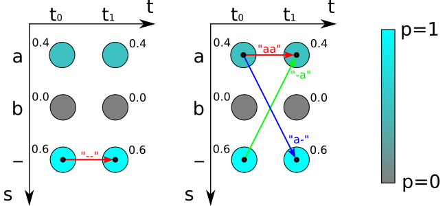

# CTC Decoding Algorithms with Language Model

## Algorithms
- Best Path Decoding: takes best label per time-step, then removes repeated labels and blanks from this path. Function: ctcBestPath. \[1]
- Beam Search Decoding: iteratively searches for best labelling, uses a character bigram language model. Function: ctcBeamSearch. \[2]
- Token Passing: searches for most probable word sequence, words are restricted to the words from a dictionary. Can be extended to also use a word-bigram language model. Function: ctcTokenPassing. \[1]

## Run
```python ctcDecoder.py```

Expected results:
```
=====Mini example=====
BEST PATH  : ""
BEAM SEARCH: "a"
=====Real example=====
BEST PATH  : "the fak friend of the fomly hae tC"
BEAM SEARCH: "the fake friend of the family, lie th"
TOKEN      : "the fake friend of the family fake the"
```

The ground-truth text is "the fake friend of the family, like the" and is a sample from the IAM Handwriting Database. 
The used RNN output was generated by a partially trained TensorFlow model.

Illustration of the "Mini example" testcase. The RNN output is a table containing 2 time-steps (t0 and t1) and 3 labels (a, b and - \[blank]).
Best path decoding takes the most probable label per time-step which gives the path "--" and therefore the recognized text B("--")="" with probability 0.6*0.6=0.36.
Beam search calculates the probability of different labelling. For the labelling "a" it sums over the paths "-a", "a-" and "aa" with probability 0.4*0.4+2*0.6*0.4=0.64.
The only path which gives "" still has probability 0.36, therefore "a" is the result returned by beam search.



## Files
- ctcDecoder.py: contains the three decoding algorithms
- data/rnnOutput.csv: output of RNN layer (softmax not yet applied), which contains 100 time-steps and 80 label scores per time-step
- data/corpus.txt: the text from which the language model is generated. In this case it is just the scrambled ground-truth text.

## Note
This python script is intended for experiments. 
For productive use I implemented the functions in C++ (for performance reasons) and then added them to TensorFlow as a custom op.

## References

\[1] Graves - Supervised sequence labelling with recurrent neural networks

\[2] Hwang - Character-level incremental speech recognition with recurrent neural networks
